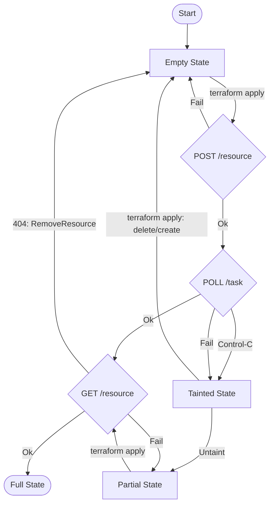

# Resource State Overview

## Terraform apply

Running `terraform apply` will transition a resource's on-disk state
as follows:

`Control-C` represents where a user presses Control C during
the polling operation.

If a resource is `tainted`, the following `terraform apply` will
delete the current resource (if it exists) and will create a fresh
resource.

A resource can be `untainted` by running
`terraform untaint resource_type.name`.
Untainted resources will not be deleted during `terraform apply` if
they are found to exist.

Since the resource's native `id` is not known for a period of time
(due to asynchronous task based creation), we do not use the native
`id` to figure out whether a resource currently exists or not. For
example, for datastores, we use the set of `hci_cluster_uuid`,
`cluster_info.id` and datastore `name` to uniquely identify a
datastore. Unlike the `id`, these three values are known _a priori_.
Some sdkv2 providers which have to deal with task based resource
creation overwrite the `id` with values that are known in advance,
so the id field looks like a/b/c, and the resource's native id is
stored with another name, eg `internal_id`. We don't need to do
that here.

In the case of datastores, we are fortunate that `names` are
unique (at least with respect to `hci_cluster_uuid` and
`cluster_info.id`. Without that characteristic we would not
be able to take the chosen approach. (For resources with
non-unique names something akin to a "create token" to guarantee
idempotency would be needed).
